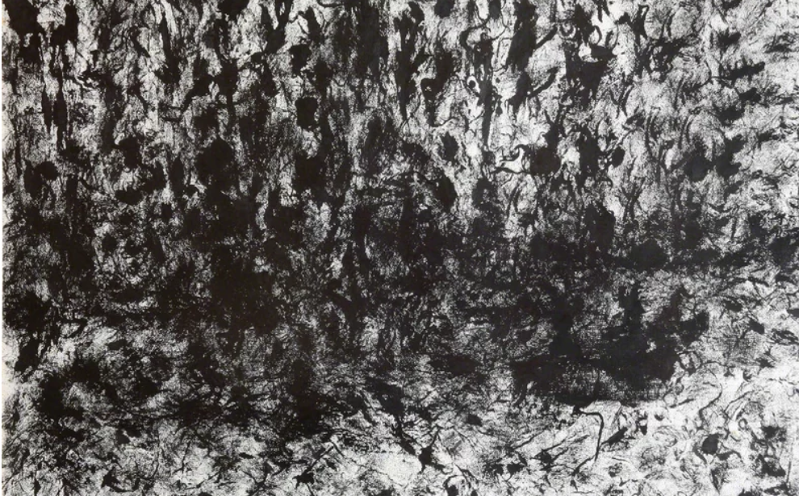
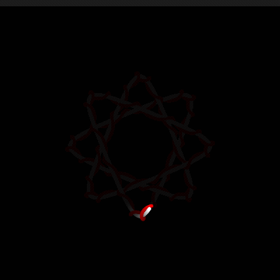
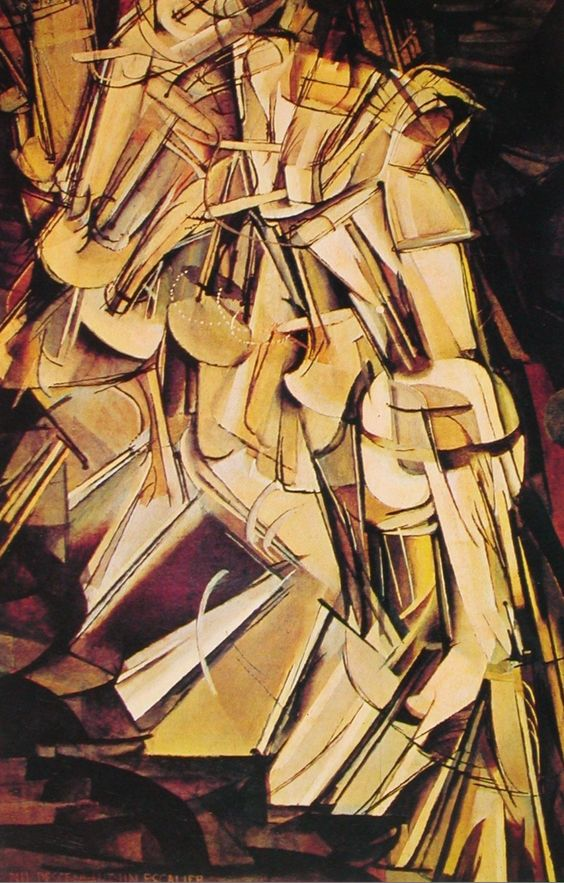
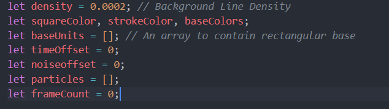

# Instructions 
 - 1. When the page loads, the animation will start automatically.
 - 2. Mouse interaction, when you move your mouse on the screen, the background color will change.
# Details 
## Method I used
- In this personal assignment I chose to use Perlin noise to show my ideas.
## The explanation of animation
 - 1. Make the green squares in my background float in waves
 - 2. Make the lines in the background that simulate the mentally retarded lines dynamic
 - 3. Make the size of the circles in the main apple tree dynamic
 - 4. Make the balls in the trunk rotate
 - 5. Using perlin noise to change the color of my background, and make it change according to the mouse position.
## references
 - 1. This picture gave me the inspiration to add flowing particles in the background.
 - 
 - 2. My friend sent me a meme of a kitten while chatting, And this GIF shows a cat shaking its head quickly and looking closely at the camera, with a strong sense of emotion and movement. This rapid shaking conveys a sense of humor while also bringing a hazy, trance-like effect. Incorporating this element into abstract art can create a visual experience that is both dreamy and funny, attracting the audience's attention while adding a wonderful emotional tension. So I thought it might be fun to add that to my work.
 - 
 - 3. These two examples from tutorial of week9 also inspired me of how I want to display the organic line on my background.
 - 
 - 
 - 4. Nu descendant un escalier n° 2, Duchamp mixed the movements of the woman going downstairs together, reflecting the change of time and the dynamics. Therefore, I also hope that my work can retain the previous frame of animation to a certain extent to reflect the passage of time.
 - 

## Changes in my code (technical description)
 - 1. I changed the density of the background particles in the initial global variable definition, and added the initial definitions of timeOffset, noiseOffset, particles, and framecount to pave the way for adding noise animation later.
 - 
 - 2. I added a particle class to the original code of the group
 - 3. I added a draw function，to make each frame of the code run repeatedly to achieve animation effects.
